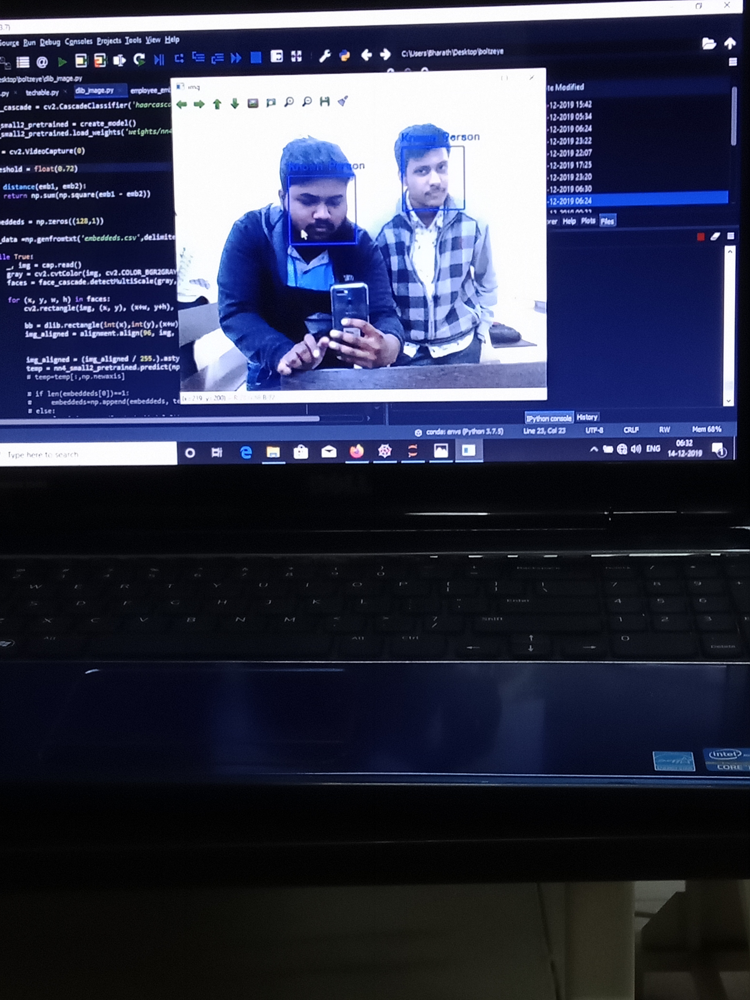

# Face-rcognization-from-webcam-video-stream-using-Opencv-dlib-and-OpenFace
A physical security application using computer vision 

This system uses the video stream from webcam and classify the persons infront of camera as known a person or a unknown person.

## Requirements
* **requirements.txt** contains all the packages used in devlopement of this system. 
* Most important dependecies of this system are dlib, opencv, openface and tkinter

## Working
* **Enployees** directory contains contains the images of persons for whom the system should show as know person.
* **datataker.py** helps in taking images from webcam and placing them in the employee directory.
* **employee_embeddeds.py** will generate the csv file  of embeddeds of faces in employee file.
* By running the **bolteye.py** you will encounter a application developed using Tkinter which ask for a username and password

    username : kaushik and password : bolt1234

* login button will lanch a python file ####dlib_image.py#### which actually classify the persons in video stream as a known person or unknown person
* you see the 'known person' or 'unknown person' right above the bounding box of the face

## Acknowledgements
* special thanks to Kaushik yathi raj and harshavardhan for frontend developing application and great UI

